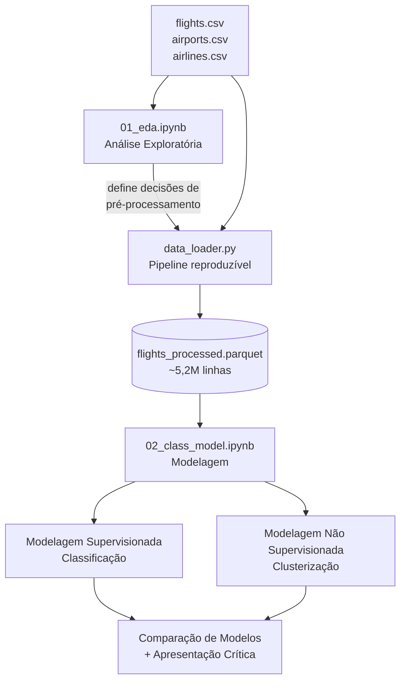

# Tech Challenge 3 — Previsão de Atrasos em Voos

> Pipeline de Machine Learning para prever se um voo chegará atrasado, utilizando dados públicos de voos dos EUA (2015). Projeto desenvolvido para a pós-graduação em Machine Learning Engineering (FIAP).

---

## Índice

- [Objetivo](#objetivo)
- [Dados](#dados)
- [Arquitetura do Projeto](#arquitetura-do-projeto)
- [Fluxo de Dados](#fluxo-de-dados)
- [Estrutura de Pastas](#estrutura-de-pastas)
- [Como Executar](#como-executar)
- [Metodologia](#metodologia)
- [Resultados](#resultados)
- [Limitações e Próximos Passos](#limitações-e-próximos-passos)
- [Tecnologias](#tecnologias)
- [Deploy](#deploy)
- [Autores](#autores)

---

## Objetivo

Construir um pipeline completo de ciência de dados — da exploração à interpretação dos resultados — aplicando técnicas de Machine Learning **supervisionado** e **não supervisionado**.

O problema de negócio: prever se um voo chegará atrasado (atraso ≥ 15 min na chegada, padrão FAA) **antes da partida**, permitindo ação antecipada (renegociação de passagens, priorização operacional).

> **Decisão metodológica:** apenas features disponíveis *antes do voo* são utilizadas. Variáveis conhecidas só após a ocorrência do voo foram descartadas para evitar *data leakage*.

---

## Dados

Base pública de voos domésticos dos EUA (2015), composta por três tabelas:

| Tabela | Descrição | Registros |
|:---|:---|:---|
| `flights.csv` | Base principal — um registro por voo | ~5,8M |
| `airports.csv` | Dicionário de aeroportos (código IATA, cidade, estado, coordenadas) | 322 |
| `airlines.csv` | Dicionário de companhias aéreas | 14 |

**Target:** `ARRIVAL_DELAY_CLASS` — binário, derivado de `ARRIVAL_DELAY ≥ 15 min`.
**Distribuição:** ~81% não atrasados / ~19% atrasados (classes desbalanceadas).

---

## Arquitetura do Projeto



> O fluxo reflete a ordem real do desenvolvimento: a **análise exploratória** (`01_eda.ipynb`) foi realizada primeiro e definiu as decisões de limpeza, seleção de features e tratamento de leakage. Essas decisões foram então implementadas no `data_loader.py`, que gera o dataset processado consumido pela modelagem.

---

## Fluxo de Dados

Etapas de transformação aplicadas pelo `data_loader.py`, na ordem de execução:


**Funil de remoção de linhas:**

| Etapa | Linhas |
|:---|---:|
| Base original | 5.819.079 |
| Após remover cancelados/desviados | −105.071 |
| Após remover `SCHEDULED_TIME` nulo | −6 |
| Após remover códigos de aeroporto inválidos (mixed types) | −482.872 |
| **Dataset final** | **5.231.130** |

---

## Estrutura de Pastas

```
Tech_challenge_3/
├── data/
│   ├── raw/                 # Dados brutos (imutáveis)
│   │   ├── flights.csv
│   │   ├── airports.csv
│   │   └── airlines.csv
│   └── processed/           # Dados processados (parquet)
├── notebooks/
│   ├── 01_eda.ipynb         # Análise exploratória
│   └── 02_class_model.ipynb # Modelagem supervisionada + não supervisionada
├── src/
│   ├── __init__.py
│   └── data_loader.py       # Pipeline de pré-processamento
├── reports/                 # Gráficos e artefatos de apresentação
├── pyproject.toml           # Configuração do pacote
├── .gitignore
└── README.md
```

---

## Como Executar

> **Pré-requisitos:** Python ≥ 3.10. Recomendado ambiente virtual.

```bash
# 1. Criar e ativar ambiente virtual
python -m venv .venv
source .venv/bin/activate          # Linux/WSL/Mac
# .venv\Scripts\activate           # Windows

# 2. Instalar dependências e o pacote local em modo editável
pip install -e .

# 3. Adicionar os dados brutos em data/raw/
#    (flights.csv, airports.csv, airlines.csv)

# 4. Executar os notebooks na ordem
#    notebooks/01_eda.ipynb
#    notebooks/02_class_model.ipynb
```

> O `02_class_model.ipynb` gera o parquet processado na primeira execução
> (via `data_loader.load_flights`). Execuções seguintes podem ler o parquet
> diretamente para maior velocidade.

---

## Metodologia

### Análise Exploratória (`01_eda.ipynb`)
- Análise de valores faltantes com verificação de hipóteses
- Identificação e tratamento de *data leakage*
- Seleção de features com base na relação com o target
- Definição das decisões de pré-processamento

### Modelagem Supervisionada (`02_class_model.ipynb`)
- **Baseline:** `DummyClassifier` (referência mínima)
- **Modelos comparados:** Decision Tree e Random Forest
- **Seleção de hiperparâmetro:** curva de validação (método do cotovelo para *max_depth*)
- **Tratamento de desbalanceamento:** `class_weight='balanced'`
- **Avaliação:** precision, recall e F1 da classe de interesse (não apenas acurácia)

### Modelagem Não Supervisionada
- **Técnica:** K-Means (clusterização de aeroportos por perfil operacional)
- **Seleção de K:** método do cotovelo
- **Features:** volume de voos, taxa de atraso, distância média, atraso médio
- **Pré-processamento:** padronização (StandardScaler)

---

## Resultados

### Classificação

Entre os modelos testados, o **Random Forest balanceado** apresentou o melhor resultado para uso real, com o melhor F1 (0,45) na classe de interesse — ou seja, o melhor equilíbrio entre capturar atrasos reais (recall) e acertar quando prevê atraso (precision).

A superioridade esperada da Random Forest sobre a Decision Tree só se confirmou após o tratamento de desbalanceamento: nos modelos sem balanceamento, ambas tiveram F1 equivalente (~0,17–0,18), pois o desbalanceamento limitava as duas igualmente. O tratamento com `class_weight='balanced'` foi o fator de maior impacto, elevando a capacidade de detectar atrasos.

Apesar de ser o melhor modelo, o F1 de 0,45 indica desempenho limitado em termos absolutos — o modelo captura pouco mais da metade dos atrasos, apontando para um teto imposto pelas features disponíveis.

### Clusterização (perfis de aeroportos)

O K-Means agrupou os aeroportos de origem em **3 perfis com características bem definidas**: grandes hubs (alto volume e longas distâncias), regionais críticos (baixo volume e baixa pontualidade) e regionais eficientes (baixo volume e alta pontualidade). Apesar de existir uma zona difusa entre dois dos grupos (em torno de 18% de taxa de atraso), a separação manteve consistência.

**As duas análises se reforçam:** a clusterização confirmou que a feature `ORIGIN_AIRPORT` é de fato relevante para o objetivo de classificação, ao revelar que existem aeroportos estruturalmente mais propensos a atraso.

---

## Limitações e Próximos Passos

### Limitações
- **Teto de features:** variáveis pré-voo não capturam as causas reais do atraso (clima, falhas mecânicas, efeito cascata). Três algoritmos diferentes atingiram o mesmo limite de desempenho.
- **Desempenho absoluto:** F1 de 0,45 — o modelo captura ~54% dos atrasos, insuficiente para produção sem melhorias.
- **Recursos computacionais:** RAM limitou os hiperparâmetros da Random Forest (50 árvores, profundidade 20).

### Próximos Passos
- Enriquecer a base com features de maior impacto: clima, congestionamento por horário, feriados, efeito cascata da aeronave.
- Incorporar dados geográficos (latitude/longitude) dos aeroportos.
- Com mais recursos computacionais, testar a Random Forest com mais árvores e maior profundidade, além de modelos mais robustos de maior demanda computacional.
- Aplicar K-Means a outras dimensões (companhias aéreas, rotas).
- Desenvolver modelo de regressão para prever a duração do atraso em minutos.

---

## Tecnologias

- **Python** 3.12
- **pandas** — manipulação de dados
- **scikit-learn** — modelagem (classificação, clusterização, métricas)
- **matplotlib** — visualização
- **pyarrow** — armazenamento em Parquet
- **Jupyter** — notebooks de análise

---

## Deploy

- **Vídeo de apresentação disponível em:** _(adicionar link)_

---

## Autores

**Adriano Cabrera**
- LinkedIn: https://www.linkedin.com/in/adriano-cabrera-b7b680a7/
- GitHub: https://github.com/cabrpin

**Caio Grazzini**
- LinkedIn: https://www.linkedin.com/in/caiograzzini/
- GitHub: https://github.com/Grazzica/

**Fabrício Batista Dias**
- LinkedIn: https://www.linkedin.com/in/fabriciobdias/
- GitHub: https://github.com/DiasFabricio

---

_Desenvolvido como parte do Tech Challenge — Pós-Graduação em Machine Learning Engineering — FIAP 2024/2025_